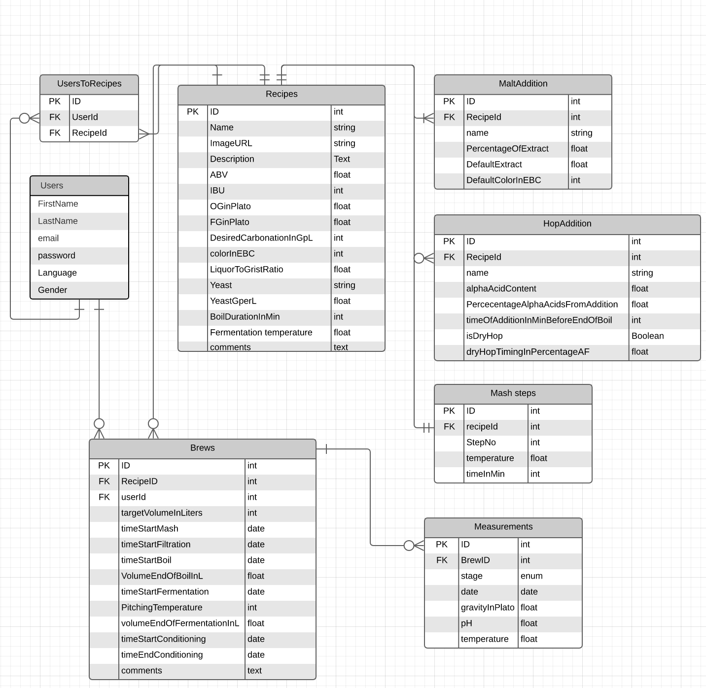

  

# Bitter - A tool for brewing calculations and recipe management

My portfolio project for the Codaisseur academy. This project was done in two weeks from planning to having a working version. This was my first attempt at coding a web app using TypeScript.

# The concept

The app can be devided into three parts:

1. A recipe management tool that allows users to import and store recipes
1. A recipe calculator that allows users to calculate the correct amount of ingredients based on specifications
1. A tool that allows to follow a brew and sets timers and reminders for the different steps of the brewing process

## Recipe management

  

The app allows a user to :

- See the recipes in his library
- Add a new recipe to his library
- Remove a recipe from his library
- Toggle between the card view mode and the full recipe page. In the full recipe page, the user can enter the amount of beer he wants to brew and the app will adapt the recipe consequently

## Recipe calculator

  

The recipe calculator allows a user to enter the beer specifications, the ingredients she wishes to use and in what ratios. Once the information is entered, the correct quantities for each ingredients and for a desired volume will be displayed in the full recipe page.

### Introducing the Beeratron 5000

A completely random beer recipe generator. The Beeratron5000 generates a random name as well as a random recipe. A user can then import it into his libary.

<b> Disclaimer:</b> Although very useful to seed a database, I do not stand by the quality of the beers generated by the beeratron. Brew at your own risk.

## Brewing day tool

The app allows a user to check he has all the ingredients to start the brew. I will also display timers for the relevant step and inform the user when it is time to add a new ingredients or move on to a new step.

# Languages and tools

This app is built using the following languages and tools:

<code></code>
<code></code>
<code></code>
<code></code>
<code></code>
<code></code>
<code></code>

# The back end

## DB model

A database model was dran on Lucid chart before starting coding. Here is the database schema:

  

## Source code

<a href='https://github.com/thibaudszy/brewing-app-backend'> Click here to see the back end repo.
